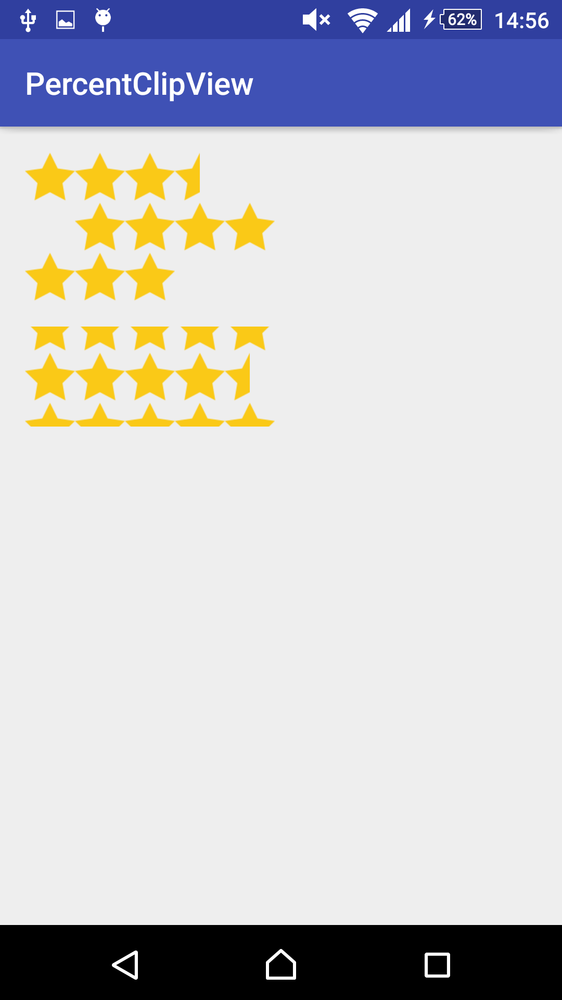

## PercentClipView &nbsp;[](https://travis-ci.org/pine/PercentClipView)

:star: Cropped layouts with percentage for Android



## Getting Started
Please type it in your build.gradle file.

```groovy
repositories {
    jcenter()
}

dependencies {
    compile 'moe.pine:percent_clip_view:0.1.0'
}
```

## Usage

```xml
<moe.pine.percent_clip_view.LinearLayout
    android:layout_width="wrap_content"
    android:layout_height="wrap_content"
    android:orientation="horizontal"
    app:clipRight="0.30">

    <ImageView
        android:layout_width="wrap_content"
        android:layout_height="wrap_content"
        android:src="@drawable/star" />

    <ImageView
        android:layout_width="wrap_content"
        android:layout_height="wrap_content"
        android:src="@drawable/star" />

    <ImageView
        android:layout_width="wrap_content"
        android:layout_height="wrap_content"
        android:src="@drawable/star" />

    <ImageView
        android:layout_width="wrap_content"
        android:layout_height="wrap_content"
        android:src="@drawable/star" />

    <ImageView
        android:layout_width="wrap_content"
        android:layout_height="wrap_content"
        android:src="@drawable/star" />
</moe.pine.percent_clip_view.LinearLayout>
```

## Reference
### Class

- FrameLayout
- LinearLayout
- RelativeLayout

### Properties

- clipTop
- clipRight
- clipBottom
- clipLeft

## Upload to Bintray

```
$ ./gradlew clean assemble bintrayUpload
```

## Acknowledgements

- [@mattak](https://github.com/mattak) I referred his [ClipView](https://github.com/mattak/ClipView)

## License
MIT &copy; Pine Mizune
